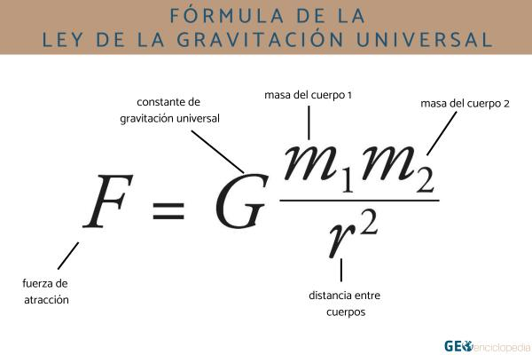

# 3 body problem

## Descripción
Simulador de interaccion gravitacional entre cuerpos con masa.
 Utiliza las leyes de newton para calcular las fuerzas y sus derivadas de 
 aceleracion y trayectoria.

 

## Tecnologías Utilizadas
- [HTML 5]
- [CSS]
- [Javascript]
- [Three js]

## Autor
- Nombre: [Vidal Matias]
- Email: [2302403]
- GitHub: [Enlace al perfil de GitHub]